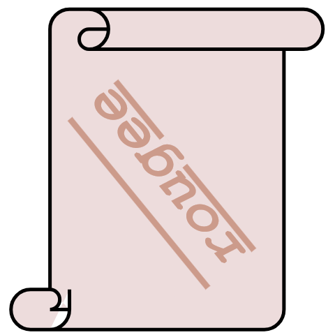

<p align="center">
  
</p>

## 编译步骤
```sh
git clone https://github.com/tsubakigal/rougee.git
git submodule update --init --recursive --depth 1
cmake -B build -A win32
cmake --build build --config Release
```

<!--
// echo | gcc -E -dM - | grep __VERSION__
// echo | clang -E -dM -
-->
